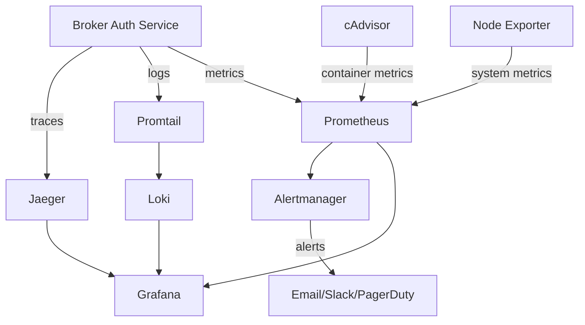

# TradeMaster Broker Auth Service - Monitoring Stack

## Overview

Comprehensive monitoring, alerting, and observability stack for the TradeMaster Broker Authentication Service. This enterprise-grade monitoring solution provides:

- **📊 Metrics Collection**: Prometheus for time-series metrics
- **📈 Visualization**: Grafana dashboards and alerting
- **🚨 Alerting**: Multi-channel alert routing via Alertmanager
- **📋 Log Aggregation**: Loki + Promtail for centralized logging
- **🔍 Distributed Tracing**: Jaeger for request tracing
- **🖥️ System Monitoring**: Node Exporter + cAdvisor for infrastructure metrics

## Quick Start

### Prerequisites

- Docker and Docker Compose installed
- TradeMaster Broker Auth Service running
- Basic understanding of Prometheus/Grafana

### 1. Setup and Start

```bash
cd monitoring
./setup-monitoring.sh setup
```

This command will:
- ✅ Validate Docker installation
- 📁 Create necessary directories
- 🔧 Set up environment variables
- 📝 Generate configuration files
- 🚀 Start all monitoring services

### 2. Access Monitoring Services

| Service | URL | Credentials |
|---------|-----|-------------|
| **Grafana** | http://localhost:3000 | admin / admin123 |
| **Prometheus** | http://localhost:9090 | - |
| **Alertmanager** | http://localhost:9093 | - |
| **Jaeger** | http://localhost:16686 | - |

## Architecture



## Monitoring Stack Components

### 🎯 Application Metrics

**Custom Business Metrics:**
- `broker_auth_success_total` - Successful authentications
- `broker_auth_failure_total` - Failed authentications
- `broker_session_created_total` - Sessions created
- `broker_session_expired_total` - Sessions expired
- `broker_token_refresh_total` - Token refreshes
- `security_violation_total` - Security violations
- `rate_limit_exceeded_total` - Rate limit violations

**Performance Metrics:**
- `broker_api_call_duration_seconds` - Broker API call latencies
- `database_operation_duration_seconds` - Database query times
- `encryption_operation_duration_seconds` - Encryption performance
- `virtual_thread_execution_duration_seconds` - Virtual thread performance

### 📊 System Metrics

**JVM Metrics:**
- Memory usage (heap/non-heap)
- Garbage collection statistics
- Thread pool metrics
- Class loading metrics

**Infrastructure Metrics:**
- CPU, memory, disk, network usage
- Container resource utilization
- Connection pool statistics
- File descriptor usage

### 🚨 Alert Categories

#### Critical Alerts (PagerDuty + Email + Slack)
- Service down
- Critical error rates (>15%)
- Extreme response times (>5s)
- Security violation spikes
- Critical memory usage (>95%)
- Database connection failures

#### Warning Alerts (Email + Slack)
- High error rates (>5%)
- High response times (>2s)
- High memory usage (>85%)
- Rate limit violations
- Invalid token attempts
- Slow database queries

## Dashboard Overview

### 📈 Main Dashboard: Broker Auth Overview

**Key Panels:**
1. **Authentication Success/Failure Rate** - Real-time auth metrics
2. **Active Broker Sessions** - Current session count
3. **Response Time (95th percentile)** - Performance tracking
4. **JVM Heap Usage** - Memory utilization
5. **Security Violations** - Security incident tracking
6. **Broker API Call Latencies** - External API performance
7. **Authentication Success by Broker** - Per-broker metrics

**SLA Monitoring:**
- 99% availability target
- <2s response time target
- <0.1% error rate target

## Configuration

### Environment Variables

Edit `monitoring/.env` to configure:

```bash
# SMTP Configuration
SMTP_PASSWORD=your_smtp_password_here
GRAFANA_SMTP_PASSWORD=your_grafana_smtp_password_here

# Slack Integration
SLACK_API_URL=https://hooks.slack.com/services/YOUR/SLACK/WEBHOOK

# PagerDuty Integration
PAGERDUTY_SERVICE_KEY=your_pagerduty_service_key_here

# Security
GF_SECURITY_ADMIN_PASSWORD=secure_admin_password
```

### Alert Routing

**Team Assignment:**
- **Platform Team**: General service health, performance
- **Security Team**: Security violations, invalid tokens
- **Integrations Team**: Broker connectivity, API issues
- **Database Team**: Database performance, connectivity

**Notification Channels:**
1. **Email**: All teams receive email notifications
2. **Slack**: Real-time alerts in team channels
3. **PagerDuty**: Critical alerts trigger on-call escalation

### Custom Metrics Integration

Add custom metrics to your Spring Boot application:

```java
@Component
public class CustomMetrics {
    
    private final Counter authSuccessCounter;
    private final Timer apiCallTimer;
    
    public CustomMetrics(MeterRegistry meterRegistry) {
        this.authSuccessCounter = Counter.builder("broker_auth_success_total")
            .description("Total successful authentications")
            .tag("broker_type", "")
            .register(meterRegistry);
            
        this.apiCallTimer = Timer.builder("broker_api_call_duration_seconds")
            .description("Broker API call duration")
            .register(meterRegistry);
    }
    
    public void recordAuthSuccess(String brokerType) {
        authSuccessCounter.increment(Tags.of("broker_type", brokerType));
    }
    
    public Timer.Sample startApiCallTimer() {
        return Timer.start(apiCallTimer);
    }
}
```

## Operations

### Management Commands

```bash
# Setup and start monitoring stack
./setup-monitoring.sh setup

# Start services
./setup-monitoring.sh start

# Stop services
./setup-monitoring.sh stop

# Restart services
./setup-monitoring.sh restart

# Check service status
./setup-monitoring.sh status

# View logs
./setup-monitoring.sh logs
```

### Health Checks

All services include health checks:

```bash
# Check Prometheus health
curl http://localhost:9090/-/healthy

# Check Grafana health
curl http://localhost:3000/api/health

# Check Alertmanager health
curl http://localhost:9093/-/healthy
```

### Backup and Recovery

**Data Persistence:**
- Prometheus data: 30-day retention
- Grafana configurations: Persistent volumes
- Alert history: 30-day retention

**Backup Strategy:**
```bash
# Backup Grafana dashboards
docker exec broker-auth-grafana grafana-cli admin export-dashboard > backup.json

# Backup Prometheus data
docker exec broker-auth-prometheus tar -czf /prometheus-backup.tar.gz /prometheus
```

## Troubleshooting

### Common Issues

#### Prometheus not scraping metrics
```bash
# Check if application metrics endpoint is accessible
curl http://localhost:8080/actuator/prometheus

# Verify Prometheus targets
# Navigate to http://localhost:9090/targets
```

#### High memory usage
```bash
# Check container resource limits
docker stats

# Review Prometheus retention settings
# Edit prometheus/prometheus.yml
```

#### Missing alerts
```bash
# Check Alertmanager configuration
docker logs broker-auth-alertmanager

# Verify alert rules
# Navigate to http://localhost:9090/alerts
```

#### Grafana dashboard not loading
```bash
# Check Grafana logs
docker logs broker-auth-grafana

# Verify datasource connectivity
# Navigate to http://localhost:3000/datasources
```

### Performance Tuning

**Prometheus Optimization:**
- Adjust scrape intervals based on metrics importance
- Configure recording rules for complex queries
- Set appropriate retention policies

**Grafana Optimization:**
- Use template variables for dynamic dashboards
- Optimize query time ranges
- Enable dashboard caching

**Alertmanager Optimization:**
- Group related alerts to reduce noise
- Configure appropriate repeat intervals
- Use inhibition rules to prevent alert storms

## Security Considerations

### Access Control

**Grafana Security:**
- Change default admin password
- Enable HTTPS in production
- Configure OAuth/LDAP integration
- Restrict dashboard editing permissions

**Network Security:**
- Use Docker networks for service isolation
- Implement firewall rules for external access
- Enable TLS for inter-service communication

### Data Privacy

- Scrub sensitive data from logs
- Encrypt metrics in transit
- Regular security audits of configurations
- Monitor access logs

## Production Deployment

### Scalability

**High Availability Setup:**
- Deploy Prometheus in cluster mode
- Configure Grafana for horizontal scaling
- Use external storage for persistence
- Implement load balancing

**Resource Planning:**
- CPU: 2-4 cores per monitoring service
- Memory: 4-8 GB for Prometheus, 2-4 GB for Grafana
- Storage: 100 GB+ for metrics retention
- Network: Dedicated monitoring VLAN

### Integration with CI/CD

```yaml
# GitHub Actions integration
- name: Deploy Monitoring Stack
  run: |
    ./monitoring/setup-monitoring.sh setup
    
# Health check integration
- name: Verify Monitoring Health
  run: |
    curl -f http://localhost:9090/-/healthy
    curl -f http://localhost:3000/api/health
```

## Support

For issues and questions:
- 📧 Email: platform-team@trademaster.com
- 📱 Slack: #platform-support
- 📖 Wiki: https://wiki.trademaster.com/monitoring
- 🐛 Issues: Create ticket in JIRA

---

**Version**: 1.0.0  
**Last Updated**: $(date)  
**Maintained by**: TradeMaster Platform Team