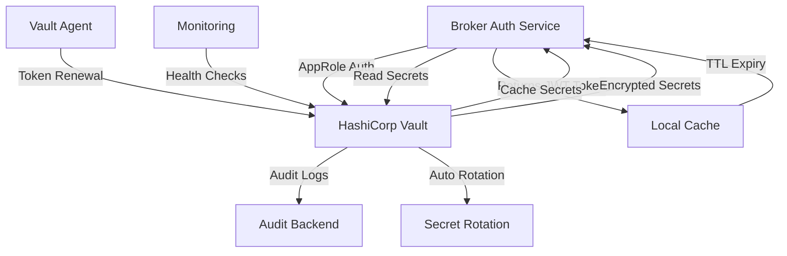

# TradeMaster Broker Auth Service - HashiCorp Vault Integration

## Overview

Enterprise-grade secrets management using HashiCorp Vault for the TradeMaster Broker Authentication Service. This integration provides:

- **🔒 Secure Secret Storage**: All sensitive credentials stored in Vault
- **🔑 Multiple Authentication Methods**: AppRole and Token authentication
- **♻️ Secret Rotation**: Automated secret rotation capabilities
- **📋 Audit Logging**: Complete audit trail for compliance
- **🚀 High Availability**: Production-ready with clustering support
- **🔧 Spring Integration**: Seamless Spring Boot/Cloud integration

## Quick Start

### 1. Development Setup

```bash
# Start Vault in development mode
cd vault
docker compose -f docker-compose.vault.yml up -d

# Initialize Vault and store secrets
./setup-vault-dev.sh

# Load environment variables
source .env.vault

# Start the application
./gradlew bootRun --args='--spring.profiles.active=vault,dev'
```

### 2. Production Deployment

```bash
# Use production Vault cluster
export VAULT_ADDR=https://vault.trademaster.com:8200
export VAULT_ROLE_ID=your_production_role_id
export VAULT_SECRET_ID=your_production_secret_id

# Start application with vault profile
java -jar broker-auth-service.jar --spring.profiles.active=vault,prod
```

## Architecture

### Vault Integration Flow



### Secret Organization

```
secret/broker-auth/
├── encryption-key          # AES-256 encryption key
├── jwt-secret              # JWT signing secret
├── database-password       # PostgreSQL password
├── redis-password          # Redis AUTH password
├── zerodha-api-key         # Zerodha Kite API key
├── zerodha-api-secret      # Zerodha Kite API secret
├── upstox-api-key          # Upstox Pro API key
├── upstox-api-secret       # Upstox Pro API secret
├── angel-one-api-key       # Angel One SmartAPI key
├── angel-one-api-secret    # Angel One SmartAPI secret
├── icici-direct-api-key    # ICICI Direct API key
└── icici-direct-api-secret # ICICI Direct API secret
```

## Configuration

### Application Configuration (`application-vault.yml`)

```yaml
# Vault Integration
vault:
  enabled: true
  uri: ${VAULT_URI:http://localhost:8200}
  secret-path: secret/broker-auth
  
  # Authentication
  app-role:
    role-id: ${VAULT_ROLE_ID:}
    secret-id: ${VAULT_SECRET_ID:}
  
  # Caching
  cache:
    enabled: true
    ttl-minutes: 5

# Spring Cloud Vault
spring:
  cloud:
    vault:
      enabled: true
      authentication: APPROLE
      kv:
        enabled: true
        backend: secret
        default-context: broker-auth
```

### Environment Variables

| Variable | Description | Example |
|----------|-------------|---------|
| `VAULT_URI` | Vault server URL | `https://vault.company.com:8200` |
| `VAULT_ROLE_ID` | AppRole Role ID | `a1b2c3d4-e5f6-...` |
| `VAULT_SECRET_ID` | AppRole Secret ID | `x1y2z3a4-b5c6-...` |
| `VAULT_TOKEN` | Vault token (dev only) | `dev-root-token` |

## Authentication Methods

### 1. AppRole Authentication (Production)

**Setup:**
```bash
# Enable AppRole
vault auth enable approle

# Create policy
vault policy write broker-auth-policy policy.hcl

# Create role
vault write auth/approle/role/broker-auth-service \
    token_policies=broker-auth-policy \
    token_ttl=1h \
    token_max_ttl=4h

# Get credentials
ROLE_ID=$(vault read -field=role_id auth/approle/role/broker-auth-service/role-id)
SECRET_ID=$(vault write -field=secret_id auth/approle/role/broker-auth-service/secret-id)
```

**Application Configuration:**
```yaml
vault:
  app-role:
    role-id: ${ROLE_ID}
    secret-id: ${SECRET_ID}
```

### 2. Token Authentication (Development)

**Setup:**
```bash
# Use root token (development only)
export VAULT_TOKEN=dev-root-token
```

**Application Configuration:**
```yaml
vault:
  token: ${VAULT_TOKEN}
```

## Secret Management

### Storing Secrets

```bash
# Store individual secret
vault kv put secret/broker-auth encryption-key="$(openssl rand -base64 48)"

# Store multiple secrets
vault kv put secret/broker-auth \
    encryption-key="secure_key_here" \
    jwt-secret="secure_jwt_secret" \
    database-password="secure_db_password"
```

### Retrieving Secrets

```bash
# Get all secrets
vault kv get secret/broker-auth

# Get specific secret
vault kv get -field=encryption-key secret/broker-auth

# JSON format
vault kv get -format=json secret/broker-auth
```

### Programmatic Access

```java
@Service
public class SecretManager {
    
    @Autowired
    private VaultSecretService vaultSecretService;
    
    public String getEncryptionKey() {
        return vaultSecretService.getEncryptionKey();
    }
    
    public Map<String, String> getBrokerCredentials(String brokerType) {
        return vaultSecretService.getBrokerCredentials(brokerType);
    }
}
```

## Secret Rotation

### Automated Rotation

```yaml
# vault-agent.hcl
vault {
  address = "http://localhost:8200"
}

auto_auth {
  method "approle" {
    config = {
      role_id_file_path   = "/vault/config/role-id"
      secret_id_file_path = "/vault/config/secret-id"
    }
  }
}

template {
  source      = "/vault/templates/secrets.tpl"
  destination = "/vault/secrets/secrets.json"
  command     = "restart-application.sh"
}
```

### Manual Rotation

```bash
# Generate new encryption key
NEW_KEY=$(openssl rand -base64 48)

# Update in Vault
vault kv patch secret/broker-auth encryption-key="$NEW_KEY"

# Application will automatically pick up new key on next read
```

## Security Features

### 1. Encryption in Transit

```yaml
vault:
  ssl:
    cert-auth-path: cert
    trust-store: /path/to/truststore.jks
    trust-store-password: ${TRUSTSTORE_PASSWORD}
```

### 2. Audit Logging

```bash
# Enable audit logging
vault audit enable file file_path=/vault/audit/audit.log

# View audit logs
tail -f /vault/audit/audit.log | jq '.'
```

### 3. Policy-Based Access Control

```hcl
# broker-auth-policy.hcl
path "secret/data/broker-auth" {
  capabilities = ["read", "update"]
}

path "secret/metadata/broker-auth" {
  capabilities = ["read", "list"]
}

path "auth/token/lookup-self" {
  capabilities = ["read"]
}
```

### 4. Secret Validation

The application validates secrets on startup:

- **Encryption Key**: Minimum 64 characters for production
- **JWT Secret**: Minimum 64 characters for production  
- **Database Password**: Minimum 24 characters for production
- **Forbidden Values**: Blocks known insecure defaults

## Monitoring and Observability

### Health Checks

```bash
# Vault health
curl http://localhost:8200/v1/sys/health

# Application vault integration health
curl http://localhost:8080/actuator/health/vault
```

### Metrics

The application exposes Vault-related metrics:

- `vault_secret_reads_total` - Total secret read operations
- `vault_secret_writes_total` - Total secret write operations
- `vault_cache_hits_total` - Cache hit rate
- `vault_cache_misses_total` - Cache miss rate
- `vault_authentication_failures_total` - Auth failures

### Dashboards

Grafana dashboard includes:

- Secret read/write rates
- Cache performance
- Authentication success/failure rates
- Secret rotation tracking

## High Availability

### Production Setup

```bash
# Vault cluster configuration
vault {
  storage "consul" {
    address = "consul.service.consul:8500"
    path    = "vault/"
  }
  
  listener "tcp" {
    address     = "0.0.0.0:8200"
    tls_cert_file = "/vault/tls/vault.crt"
    tls_key_file  = "/vault/tls/vault.key"
  }
  
  cluster_addr = "https://vault-1.service.consul:8201"
  api_addr = "https://vault.service.consul:8200"
}
```

### Load Balancer Configuration

```nginx
upstream vault_backend {
    server vault-1.internal:8200;
    server vault-2.internal:8200;
    server vault-3.internal:8200;
}

server {
    listen 443 ssl;
    server_name vault.company.com;
    
    location / {
        proxy_pass https://vault_backend;
        proxy_ssl_verify off;
    }
}
```

## Disaster Recovery

### Backup Strategy

```bash
# Backup Vault data
vault operator raft snapshot save backup.snap

# Restore from backup
vault operator raft snapshot restore backup.snap
```

### Key Recovery

```bash
# Generate recovery keys
vault operator generate-recovery-key -format=json

# Use recovery key if needed
vault operator unseal -recovery-key
```

## Development Tools

### Vault CLI Commands

```bash
# List secrets
vault kv list secret/

# Get secret versions
vault kv metadata get secret/broker-auth

# Delete secret
vault kv delete secret/broker-auth

# Undelete secret
vault kv undelete -versions=2 secret/broker-auth
```

### Testing

```bash
# Run Vault integration tests
./gradlew test --tests VaultIntegrationTest

# Test with different profiles
./gradlew test -Dspring.profiles.active=vault,test
```

## Troubleshooting

### Common Issues

#### 1. Authentication Failures

```bash
# Check AppRole configuration
vault read auth/approle/role/broker-auth-service

# Verify role-id and secret-id
vault write auth/approle/login role_id=$ROLE_ID secret_id=$SECRET_ID
```

#### 2. Connection Issues

```bash
# Test connectivity
curl -k $VAULT_ADDR/v1/sys/health

# Check DNS resolution
nslookup vault.company.com

# Verify certificates
openssl s_client -connect vault.company.com:8200
```

#### 3. Permission Denied

```bash
# Check current token capabilities
vault token capabilities secret/broker-auth

# List policies
vault token lookup -format=json | jq .data.policies

# Verify policy
vault policy read broker-auth-policy
```

#### 4. Secret Not Found

```bash
# List all secrets
vault kv list secret/

# Check secret path
vault kv get secret/broker-auth

# Verify application configuration
grep -r "secret-path" src/main/resources/
```

### Debug Logging

```yaml
logging:
  level:
    org.springframework.vault: DEBUG
    com.trademaster.brokerauth.service.VaultSecretService: DEBUG
```

## Best Practices

### Security

1. **Never commit Vault tokens or credentials**
2. **Use AppRole for production authentication**
3. **Enable audit logging**
4. **Implement proper RBAC policies**
5. **Use TLS in production**
6. **Rotate secrets regularly**

### Performance

1. **Enable caching with appropriate TTL**
2. **Batch secret operations**
3. **Monitor cache hit rates**
4. **Use connection pooling**
5. **Set reasonable timeouts**

### Operations

1. **Monitor Vault health**
2. **Set up alerting for auth failures**
3. **Backup Vault data regularly**
4. **Test disaster recovery procedures**
5. **Document secret rotation procedures**

## Support

For issues and questions:
- 📧 Email: platform-team@trademaster.com
- 📱 Slack: #vault-support
- 📖 Wiki: https://wiki.trademaster.com/vault
- 🐛 Issues: Create ticket in JIRA

---

**Version**: 1.0.0  
**Last Updated**: $(date)  
**Maintained by**: TradeMaster Platform Team